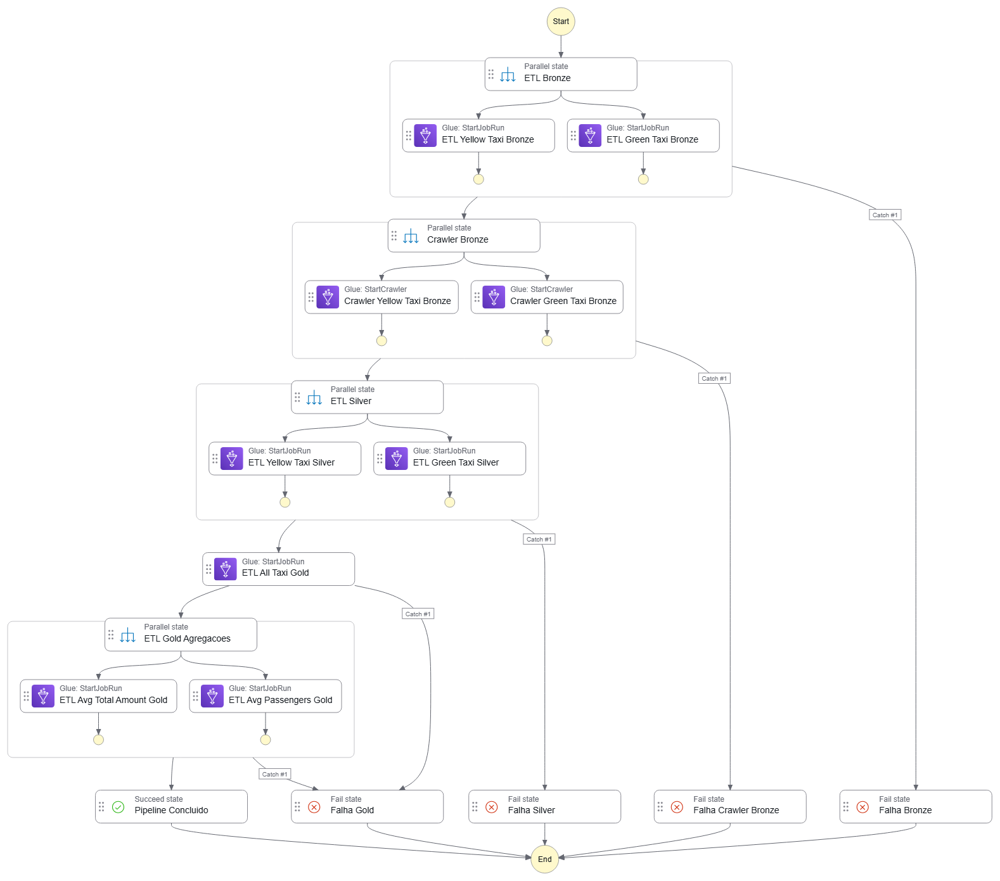
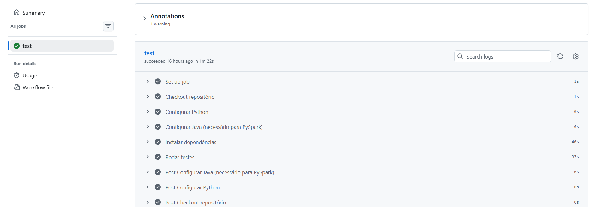
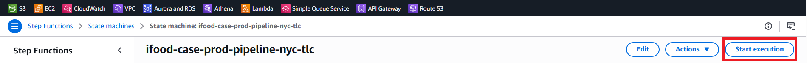
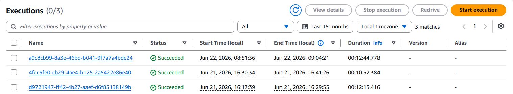

# iFood Case Técnico — Data Architect

Pipeline de dados end-to-end para ingestão, transformação e análise das corridas de táxi de Nova York (NYC TLC), utilizando arquitetura Medallion (Bronze → Silver → Gold) na AWS.

---

## Solução

Este repositório implementa uma solução completa para o case técnico iFood, atendendo todos os requisitos propostos:

| Requisito | Solução |
|---|---|
| Ingestão no Data Lake | AWS Glue Jobs (PySpark) — Bronze → Silver → Gold |
| PySpark em alguma etapa | Silver e Gold inteiramente em PySpark |
| Disponibilizar para usuários finais | Amazon Athena via Glue Data Catalog |
| Colunas obrigatórias presentes | Garantidas no schema Silver e Gold |
| Modelagem das tabelas | 7 tabelas modeladas via Terraform no Glue Catalog |
| Respostas às perguntas | `table_avg_total_amount_gold` e `table_avg_passengers_gold` |

> A solução foi implementada na AWS em vez do Databricks Community Edition — 100% nativo no ecossistema AWS (Glue + S3 + Athena + Step Functions). O AWS Glue oferece integração nativa com o Glue Data Catalog, eliminando configuração manual de metastore, enquanto o Databricks Community Edition não suporta orquestração, não persiste clusters e tem recursos computacionais limitados. A infraestrutura é totalmente reproduzível via `terraform apply` e o código validado continuamente via CI com GitHub Actions.

---

## Arquitetura


```
NYC TLC (fonte)
        ↓
S3 Bronze  ← dados brutos particionados
        ↓
S3 Silver  ← dados limpos, tipados e padronizados
        ↓
S3 Gold    ← dados agregados para consumo analítico
        ↓
Athena     ← consulta SQL para usuários finais
```

**Stack:**
- **Armazenamento:** Amazon S3 (arquitetura Medallion)
- **Processamento:** AWS Glue Jobs (PySpark)
- **Catálogo:** AWS Glue Data Catalog
- **Consulta:** Amazon Athena
- **Orquestração:** AWS Step Functions
- **Infraestrutura:** Terraform
- **CI:** GitHub Actions

---

## Por que arquitetura Medallion?

A arquitetura Medallion organiza os dados em camadas progressivas de qualidade, cada uma com um propósito claro:

**Bronze — dados brutos**
Preserva os dados exatamente como vieram da fonte, sem transformações. Garante rastreabilidade total e permite reprocessamento a qualquer momento caso regras de negócio mudem.

**Silver — dados confiáveis**
Schema padronizado, tipos corretos e nulos removidos. Essa camada é a fonte de verdade para qualquer análise — todos os consumidores partem daqui com a mesma base.

**Gold — dados prontos para consumo**
Tabelas pré-agregadas e otimizadas para responder perguntas de negócio específicas com alta performance no Athena, sem necessidade de joins ou agregações custosas em tempo de consulta.

---

## Modelagem de Dados

Os schemas completos de todas as tabelas estão documentados em [infra/glue/catalog/README.md](infra/glue/catalog/README.md).

A referência operacional dos Glue Jobs com tempos de execução está em [infra/glue/jobs/README.md](infra/glue/jobs/README.md).

---

## Orquestração — Step Functions

O pipeline é orquestrado pela AWS Step Functions com execução paralela por camada e retry automático com backoff exponencial em caso de falha.



**Fluxo de execução:**

```
1. Bronze (paralelo)   — Yellow e Green simultaneamente
2. Crawler Bronze      — registra partições no Glue Catalog
3. Silver (paralelo)   — Yellow e Green simultaneamente
4. Gold All Taxi       — consolida Yellow + Green
5. Gold Agregações     — Avg Total Amount e Avg Passengers simultaneamente
```

**Resiliência:**
- Retry automático: até 3 tentativas com backoff exponencial (30s → 60s → 120s)
- Catch de erros por camada: se falhar após todos os retries, a Step Function marca a etapa com erro e interrompe o pipeline

---

## CI — GitHub Actions

Testes automatizados rodam a cada push e pull request nas branches `main` e `develop`.



**78 testes cobrindo:**
- Extract — download HTTP e tratamento de erros
- Transform — schema, tipos, nulos e filtros de qualidade
- Load — paths S3 e configurações de escrita Parquet

---

## Pré-requisitos

- [Terraform](https://developer.hashicorp.com/terraform/downloads) >= 1.5.0
- [AWS CLI](https://aws.amazon.com/cli/) configurado com permissões de administrador
- Python 3.12+
- Conta AWS ativa

---

## Como reproduzir

### 1. Clone o repositório

```bash
git clone https://github.com/seu-usuario/ifood-case-data-architect.git
cd ifood-case-data-architect
```

### 2. Configure as credenciais AWS

```bash
aws configure
```

### 3. Configure o `terraform.tfvars`

Crie o arquivo `infra/terraform.tfvars`:

```hcl
aws_region  = "sua-regiao"   # exemplo: "us-east-1", "sa-east-1", "eu-west-1"
bucket_name = "seu-bucket"   # deve ser único globalmente na AWS
```

> **Atenção:** o `bucket_name` deve ser único globalmente na AWS. Use um nome personalizado como `ifood-case-data-lake-seu-nome`.

### 4. Provisione a infraestrutura

```bash
cd infra
terraform init
terraform plan
terraform apply
```

O Terraform provisiona automaticamente:
- Bucket S3 com estrutura Bronze/Silver/Gold
- Upload dos scripts ETL para o S3
- Glue Jobs por camada (Bronze, Silver e Gold)
- Glue Crawlers Bronze
- Glue Data Catalog (databases e tabelas)
- IAM Role com permissões necessárias
- Step Function com retry e catch de erros

### 5. Execute o pipeline

Após o `terraform apply`, dispare a Step Function:

```bash
aws stepfunctions start-execution \
  --state-machine-arn $(terraform output -raw stepfunction_arn) \
  --name "execucao-inicial" \
  --region sua-regiao
```

Ou pelo console AWS:

```
AWS Console → Step Functions → ifood-case-prod-pipeline-nyc-tlc → Start execution
```


Aguarde ~10-12 minutos. Ao finalizar com sucesso:



---

## Consultas

As queries e instruções de como executar no Athena estão em [analysis/README.md](analysis/README.md).

---

## Estrutura do Repositório

```
ifood-case-data-architect/
├── src/                                   # Scripts ETL por camada
│   ├── bronze/                            # Ingestão — NYC TLC → S3
│   │   ├── etl_yellow_taxi_bronze.py
│   │   └── etl_green_taxi_bronze.py
│   ├── silver/                            # Transformação — Bronze → S3
│   │   ├── etl_yellow_taxi_silver.py
│   │   └── etl_green_taxi_silver.py
│   └── gold/                              # Agregação — Silver → S3
│       ├── etl_all_taxi_gold.py           # Consolida Yellow + Green
│       ├── etl_avg_total_amount_gold.py   # Média total_amount por mês
│       └── etl_avg_passengers_gold.py     # Média passageiros por hora
├── tests/                                 # 78 testes pytest por camada
│   ├── bronze/
│   ├── silver/
│   ├── gold/
│   ├── awsglue/                           # Mocks do AWS Glue
│   └── requirements-test.txt             # Dependências de teste
├── infra/                                 # Infraestrutura Terraform
│   ├── terraform.tfvars                   # Configurações do ambiente
│   ├── s3/                                # Bucket S3 + upload dos scripts
│   ├── iam/                               # Role e policies
│   ├── glue/
│   │   ├── jobs/                          # Um .tf por Glue Job — ver README
│   │   │   ├── bronze/
│   │   │   ├── silver/
│   │   │   └── gold/
│   │   └── catalog/                       # Modelagem das tabelas — ver README
│   │       ├── bronze/                    # Crawlers Bronze
│   │       ├── silver/                    # Tabelas Silver
│   │       └── gold/                      # Tabelas Gold
│   └── stepfunction/                      # Step Function + IAM + CloudWatch
├── analysis/                              # Consultas e resultados — ver README
│   ├── queries.sql
│   └── queries.ipynb
├── doc/                                   # Imagens da documentação
├── .github/
│   └── workflows/
│       └── pipeline.yml                   # CI — testes em push e PR
└── README.md
```

---

## Como destruir a infraestrutura

```bash
cd infra
terraform destroy
```