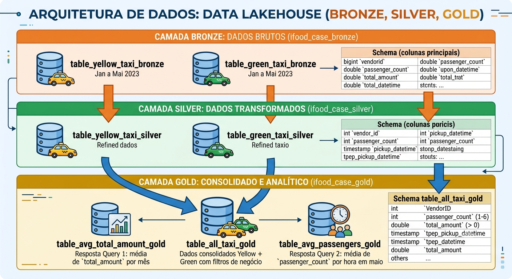
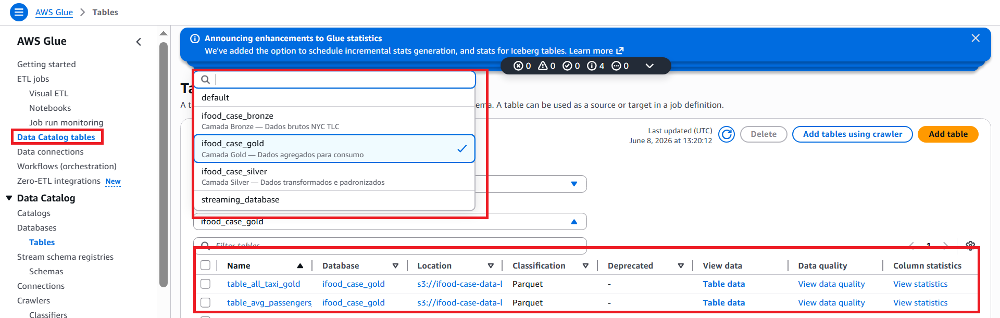
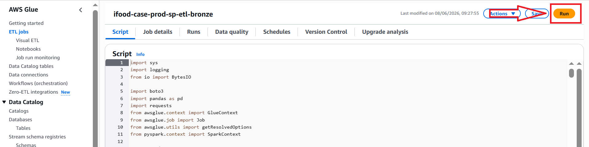
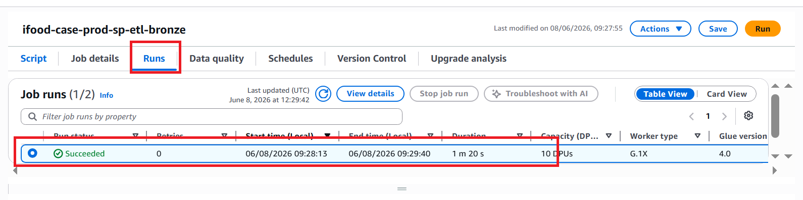
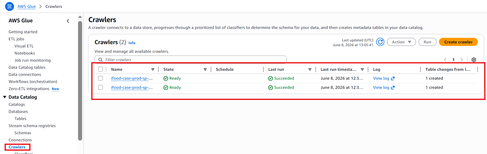
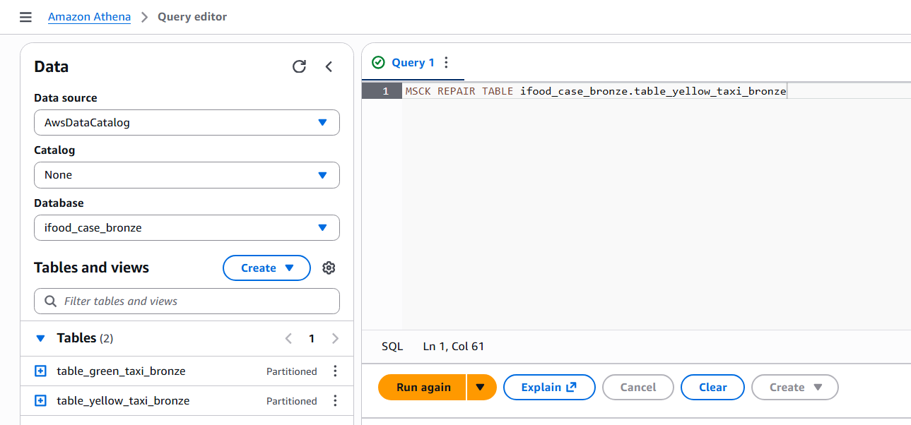

# iFood Case Técnico — Data Architect

Pipeline de dados end-to-end para ingestão, transformação e análise das corridas de táxi de Nova York (NYC TLC), utilizando arquitetura Medallion (Bronze → Silver → Gold) na AWS.

---

## Arquitetura

```
NYC TLC (fonte)
        ↓
S3 Bronze  ← dados brutos particionados
        ↓
S3 Silver  ← dados limpos, tipados e padronizados
        ↓
S3 Gold    ← dados agregados para consumo analítico
        ↓
Athena     ← consulta SQL para usuários finais
```

**Stack:**
- **Armazenamento:** Amazon S3 (arquitetura Medallion)
- **Processamento:** AWS Glue Jobs (PySpark)
- **Catálogo:** AWS Glue Data Catalog
- **Consulta:** Amazon Athena
- **Infraestrutura:** Terraform

---

## Arquitetura Medallion



### Bronze — `ifood_case_bronze`

| Tabela | Descrição |
|---|---|
| `table_yellow_taxi_bronze` | Dados brutos Yellow Taxi — Jan a Mai 2023 |
| `table_green_taxi_bronze` | Dados brutos Green Taxi — Jan a Mai 2023 |

**Schema (colunas principais):**

| Coluna | Tipo | Descrição |
|---|---|---|
| `vendorid` | bigint | ID do fornecedor |
| `passenger_count` | double | Número de passageiros |
| `total_amount` | double | Valor total da corrida em USD |
| `tpep_pickup_datetime` | timestamp | Início da corrida (Yellow) |
| `lpep_pickup_datetime` | timestamp | Início da corrida (Green) |
| `partition_year` | string | Partição — ano |
| `partition_month` | string | Partição — mês |

---

### Silver — `ifood_case_silver`

| Tabela | Descrição |
|---|---|
| `table_yellow_taxi_silver` | Dados transformados Yellow Taxi |
| `table_green_taxi_silver` | Dados transformados Green Taxi |

**Schema:**

| Coluna | Tipo | Descrição |
|---|---|---|
| `vendor_id` | int | ID do fornecedor |
| `passenger_count` | int | Número de passageiros |
| `total_amount` | double | Valor total da corrida em USD |
| `pickup_datetime` | timestamp | Início da corrida |
| `dropoff_datetime` | timestamp | Fim da corrida |
| `taxi_type` | string | Tipo do táxi — `yellow` ou `green` |
| `partition_year` | int | Partição — ano |
| `partition_month` | int | Partição — mês |

---

### Gold — `ifood_case_gold`

| Tabela | Descrição |
|---|---|
| `table_all_taxi_gold` | Dados consolidados Yellow + Green com filtros de negócio |
| `table_avg_total_amount_gold` | Resposta Query 1 — média de `total_amount` por mês |
| `table_avg_passengers_gold` | Resposta Query 2 — média de `passenger_count` por hora em maio |

**Schema `table_all_taxi_gold`:**

| Coluna | Tipo | Descrição |
|---|---|---|
| `VendorID` | int | ID do fornecedor |
| `passenger_count` | int | Número de passageiros (entre 1 e 6) |
| `total_amount` | double | Valor total da corrida em USD (> 0) |
| `tpep_pickup_datetime` | timestamp | Início da corrida |
| `tpep_dropoff_datetime` | timestamp | Fim da corrida |
| `taxi_type` | string | Tipo do táxi — `yellow` ou `green` |
| `partition_year` | int | Partição — ano |
| `partition_month` | int | Partição — mês |

---

### Catálogo de Dados e Metadados

Todos os metadados, definições de schemas e partições das tabelas descritas acima estão centralizados no **AWS Glue Data Catalog**. 


---

## Pré-requisitos

- [Terraform](https://developer.hashicorp.com/terraform/downloads) >= 1.5.0
- [AWS CLI](https://aws.amazon.com/cli/) configurado com permissões de administrador
- Python 3.12+
- Conta AWS ativa

---

## Como reproduzir

### 1. Clone o repositório

```bash
git clone https://github.com/seu-usuario/ifood-case-data-architect.git
cd ifood-case-data-architect
```

### 2. Configure as credenciais AWS

```bash
aws configure
```

### 3. Configure o `terraform.tfvars`

Crie o arquivo `infra/terraform.tfvars` com as seguintes variáveis:

```hcl
# ─── Configurações do usuário ───────────────────────────────────
# aws_region  → região onde os recursos serão criados
#               exemplo: "us-east-1", "sa-east-1", "eu-west-1"
# bucket_name → nome único global do bucket S3
#               deve ser único em toda a AWS — use um nome personalizado
aws_region  = "sua-regiao"
bucket_name = "seu-bucket-unico"

# ─── Não alterar ────────────────────────────────────────────────
glue_database_bronze = "ifood_case_bronze"
glue_database_silver = "ifood_case_silver"
glue_database_gold   = "ifood_case_gold"
project_name         = "ifood-case"
environment          = "prod"
```

> **Atenção:** o `bucket_name` deve ser único globalmente na AWS. Use um nome personalizado como `ifood-case-data-lake-seu-nome`.

### 4. Provisione a infraestrutura

```bash
cd infra
terraform init
terraform plan
terraform apply
```

O Terraform vai provisionar automaticamente:
- Bucket S3 com estrutura Bronze/Silver/Gold
- Upload dos scripts ETL para o S3
- Glue Jobs (Bronze, Silver e Gold)
- Glue Crawlers Bronze
- Glue Data Catalog (databases e tabelas)
- IAM Role com permissões necessárias

---

## Execução do Pipeline

> **Importante:** siga a ordem abaixo rigorosamente. Cada etapa depende da anterior.

### Etapa 1 — ETL Bronze

```
AWS Console → Glue → Jobs → ifood-case-prod-etl-bronze → Run
```



Aguarde o job finalizar com sucesso (~15 min).



Após o job finalizar, execute os Crawlers para registrar as tabelas no Glue Catalog:

```bash
aws glue start-crawler --name ifood-case-prod-crawler-bronze-yellow-taxi --region sua-regiao
aws glue start-crawler --name ifood-case-prod-crawler-bronze-green-taxi --region sua-regiao
```



Aguarde os Crawlers finalizarem e registre as partições no Athena. Registre as partições no Athena — execute **uma query por vez**:

```sql
MSCK REPAIR TABLE ifood_case_bronze.table_yellow_taxi_bronze;
```

```sql
MSCK REPAIR TABLE ifood_case_bronze.table_green_taxi_bronze;
```


---

### Etapa 2 — ETL Silver

```
AWS Console → Glue → Jobs → ifood-case-prod-etl-silver → Run
```

Aguarde o job finalizar com sucesso.

Registre as partições no Athena:

```sql
MSCK REPAIR TABLE ifood_case_silver.table_yellow_taxi_silver;
MSCK REPAIR TABLE ifood_case_silver.table_green_taxi_silver;
```

---

### Etapa 3 — ETL Gold

```
AWS Console → Glue → Jobs → ifood-case-prod-etl-gold → Run
```

Aguarde o job finalizar com sucesso.

Registre as partições no Athena:

```sql
MSCK REPAIR TABLE ifood_case_gold.table_all_taxi_gold;
MSCK REPAIR TABLE ifood_case_gold.table_avg_passengers_gold;
MSCK REPAIR TABLE ifood_case_gold.table_avg_total_amount_gold;
```

---

## Consultas

Com o pipeline completo, execute as queries no Athena ou via `analysis/queries.ipynb`:

**Query 1 — Média de total_amount por mês (Yellow Taxi):**
```sql
SELECT mes, avg_total_amount
FROM ifood_case_gold.table_avg_total_amount_gold
ORDER BY mes;
```

**Query 2 — Média de passenger_count por hora em maio (todos os táxis):**
```sql
SELECT hora, avg_passenger_count
FROM ifood_case_gold.table_avg_passengers_gold
ORDER BY hora;
```

---

## Estrutura do Repositório

```
ifood-case-data-architect/
├── src/
│   ├── etl_bronze.py          # Ingestão Bronze — NYC TLC → S3
│   ├── etl_silver.py          # Transformação Silver — Bronze → S3
│   └── etl_gold.py            # Agregação Gold — Silver → S3
├── analysis/
│   ├── queries.sql            # Queries SQL das perguntas do case
│   └── queries.ipynb          # Notebook com resultado das queries
├── exploratory/
│   ├── exploratory_source.ipynb
│   ├── exploratory_bronze.ipynb
│   ├── exploratory_silver.ipynb
│   └── exploratory_gold.ipynb
├── infra/
│   ├── terraform.tfvars       # Configurações do ambiente (não versionado)
│   ├── s3/                    # Bucket S3 + upload dos scripts
│   ├── iam/                   # Role e policies
│   └── glue/                  # Jobs, Crawlers e Catalog
├── README.md
└── requirements.txt
```

---

## Como destruir a infraestrutura

```bash
cd infra
terraform destroy
```
